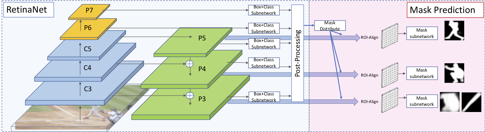

# RetinaMask

The code is based on the [maskrcnn-benchmark](https://github.com/facebookresearch/maskrcnn-benchmark).




### Citing RetinaMask
Please cite RetinaMask in your publications if it helps your research:

    @inproceedings{fu2019retinamask,
      title = {{RetinaMask}: Learning to predict masks improves state-of-the-art single-shot detection for free},
      author = {Fu, Cheng-Yang and  Shvets, Mykhailo and Berg, Alexander C.},
      booktitle = {arXiv preprint arXiv:1901.03353},
      year = {2019}
    }


### Contents
1. [Installation](#installation)
2. [Models](#models)

### Installation 
Follow the [maskrcnn-benchmark](./OLD_README.md) to install code and set up the dataset. Use config files in ./configs/retina/ for Training and Testing.


### Models

| Models         | BBox          | B(time)   | Mask  | M(time)    | Link |
| -------------- | ------------- | ---| ----- | --- | ---- |
| ResNet-50-FPN  | 39.4/58.6/42.3/21.9/42.0/51.0 | 0.124 | 34.9/55.7/37.1/15.1/36.7/50.4 | 0.139 | [link](https://drive.google.com/file/d/17QnkNoibgzRnnSeLDFo27LmgPUifFBxz/view?usp=sharing) |
| ResNet-101-FPN | 41.4/ 60.8/44.6/23.0/44.5/53.5 | 0.145 | 36.6/58.0/39.1/16.2/38.8/52.7 | 0.160 | [link](https://drive.google.com/file/d/1Fl-TI1oDRVBFYI1h1mn7IiEOXwTIR3AC/view?usp=sharing) |
| ResNet-101-FPN-GN | 41.7/61.7/45.0/23.5/44.7/52.8 | 0.153 | 36.7/58.8/39.3/16.4/39.4/52.6 | 0.164 | [link](https://drive.google.com/file/d/19MCU9Q0YXbIrc4fRSPRV53T_RSxiVqh0/view?usp=sharing) | 
| ResNeXt32x8d-101-FPN-GN  | 42.6/62.5/46.0/24.8/45.6/53.8 | 0.231 | 37.4/59.8/40.0/17.6/39.9/53.4 | 0.270 | [link](https://drive.google.com/file/d/1n-tcTUZ28s0uvDOB_gZmsFtxA8flGxKF/view?usp=sharing) |

P.S. evaluation metric: AP, AP50, AP75, AP(small), AP(medium), AP(large), please refer to [COCO](http://cocodataset.org/#detection-eval) for detailed explanation. The inference time is measured on Nvidia 1080Ti.


#### Run Inference
Use the following scripts. (Assume models are download to the ./models directory)
Run Mask and BBox
```
python tools/test_net.py --config-file ./configs/retina/retinanet_mask_R-50-FPN_2x_adjust_std011_ms.yaml MODEL.WEIGHT ./models/retinanet_mask_R-50-FPN_2x_adjust_std011_ms_model.pth

```
Run BBox only
```
python tools/test_net.py --config-file ./configs/retina/retinanet_mask_R-50-FPN_2x_adjust_std011_ms.yaml MODEL.WEIGHT ./models/retinanet_mask_R-50-FPN_2x_adjust_std011_ms_model.pth MODEL.MASK_ON False

```
